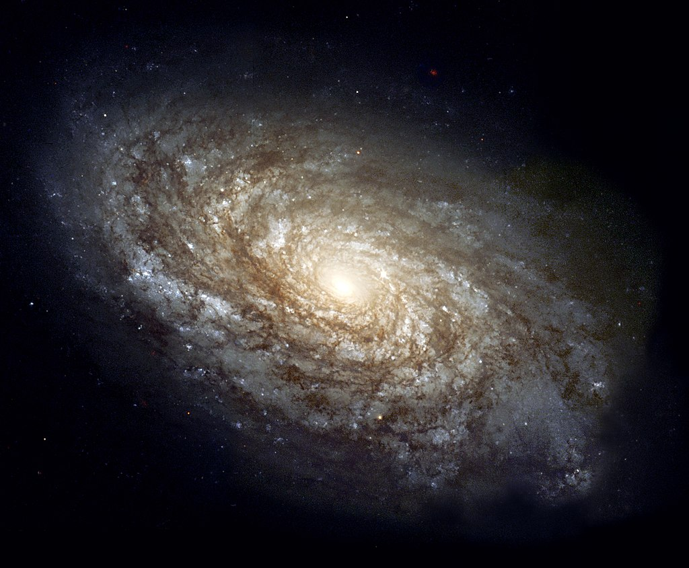
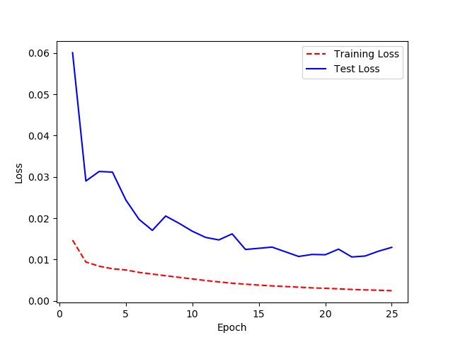
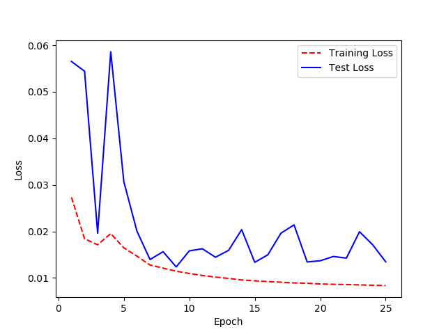

# Galaxy-Zoo
Galaxy Zoo - The Galaxy Challenge

This is a quick Kaggle project based on the [Galaxy Zoo challenge](https://www.kaggle.com/c/galaxy-zoo-the-galaxy-challenge). In total I trained 3 models using Tensorflow on my gtx 1080, each taking 4-6 hours to train.

## Model 1
*RMSE:* 0.11314

| Model             | [NasNet Mobile](https://keras.io/api/applications/nasnet/)  |
|-------------------|---------------|
| Train/Val split   | 70/25         |
| Data Augmentation | None          |
| Learning rate     | 0.001         |
| Optimizer         | Adam          |
| Epochs            | 25            |

## Model 2
*RMSE:* 0.11896

| Model             | [NasNet Mobile](https://keras.io/api/applications/nasnet/) |
|-------------------|---------------|
| Train/Val split   | 90/10         |
| Data Augmentation | Rotation of 180 Degrees, vertical \& horizontal flips          |
| Learning rate     | 0.001         |
| Optimizer         | Adam          |
| Epochs            | 25            |

## Model 3
*RMSE:* 0.11340

| Model             | [Mobile Net V2](https://keras.io/api/applications/mobilenet/#mobilenetv2-function) |
|-------------------|---------------|
| Train/Val split   | 95/10         |
| Data Augmentation | Rotation of 90 Degrees, vertical \& horizontal flips          |
| Learning rate     | 0.001         |
| Optimizer         | Adam          |
| Epochs            | 25            |

## Potential Improvements
* Decayed the Learning Rate
* Use a better directory structure.
* Find and read more academic papers relating to the topic.
* Use a systematic way to debug the model.
* Create and Train a custom CNN + FC model.
